# OXO Carriers — Entity Relationship Diagram

> Complete data model of the OXO Carriers HR / Finance / Facilities backend.
> Source of truth: [src/db/schema](../src/db/schema) (Drizzle ORM + PostgreSQL).
> 18 tables across 7 functional modules. Generated 2026-07-02.

---

## 1. System Overview

OXO Carriers is an internal **HR & Finance management platform**. The `users` table
is the hub of the entire model — nearly every other table references it. The system
is organised into seven functional modules:

| Module | Tables | Purpose |
|--------|--------|---------|
| **Identity & Access** | `users`, `user_permissions`, `tbl_employee_pii` | Accounts, roles, fine-grained permissions, encrypted PII |
| **Leave Management** | `leave_types`, `employee_leave_balance`, `leave_requests`, `leave_calendar` | Leave catalog, balances, requests & approvals, holidays |
| **Payroll / Salary** | `salary_components`, `employee_salary_structure`, `monthly_salaries`, `salary_slip_details` | Salary structure, monthly runs, payslip line items |
| **Facilities** | `facilities`, `facility_bookings` | Rooms / workstations / accommodation & their bookings |
| **Medical Insurance** | `medical_insurance_claims` | IN / OPD claims with review workflow |
| **Consultant Work** | `consultant_work_submissions` | Consultant timesheet / work log submissions |
| **Vendor & Payments** | `vendors`, `payment_vouchers` | Service providers and payment vouchers |
| **Audit** | `audit_logs` | Change-tracking across the system |

---

## 2. Full Entity Relationship Diagram

```mermaid
erDiagram
    %% ============ IDENTITY & ACCESS ============
    users {
        serial id PK
        varchar employee_id UK "nullable, business key"
        varchar email UK "not null"
        varchar keycloak_sub "SSO subject"
        varchar first_name
        varchar last_name
        boolean email_verified
        varchar email_verification_token
        user_role role "enum, not null"
        varchar department
        varchar position
        varchar hourly_rate
        varchar bank_name
        varchar account_holder_name
        varchar account_number
        varchar bank_branch
        varchar company_name
        varchar contact_number
        date hire_date
        integer manager_id FK "self-ref"
        timestamp created_at
        timestamp updated_at
    }

    tbl_employee_pii {
        serial id PK
        varchar employee_id UK,FK "-> users.employee_id"
        bytea passport_number "encrypted"
        bytea national_id "encrypted"
        bytea address "encrypted"
        bytea emergency_contact_name "encrypted"
        bytea emergency_contact_phone "encrypted"
        timestamp created_at
        timestamp updated_at
    }

    user_permissions {
        serial id PK
        integer user_id FK "-> users.id"
        varchar permission_key
        access_level access_level "enum read|write"
        integer assigned_by FK "-> users.id"
        timestamp created_at
        timestamp updated_at
    }

    %% ============ LEAVE MANAGEMENT ============
    leave_types {
        serial id PK
        varchar name
        text description
        integer max_days
        boolean is_active
        timestamp created_at
    }

    employee_leave_balance {
        serial id PK
        integer user_id FK "-> users.id"
        integer leave_type_id FK "-> leave_types.id"
        decimal total_days
        decimal used_days
        decimal remaining_days
        integer year
        timestamp created_at
        timestamp updated_at
    }

    leave_requests {
        serial id PK
        integer user_id FK "-> users.id"
        integer leave_type_id FK "-> leave_types.id"
        date start_date
        date end_date
        decimal total_days
        boolean is_half_day
        half_day_period half_day_period "enum morning|evening"
        text reason
        leave_status status "enum"
        timestamp team_leader_approval_date
        timestamp hr_approval_date
        text rejection_reason
        varchar attachment_url
        timestamp created_at
        timestamp updated_at
    }

    leave_calendar {
        serial id PK
        date date UK
        varchar name
        text description
        boolean is_recurring
        integer year
        integer created_by FK "-> users.id"
        timestamp created_at
        timestamp updated_at
    }

    %% ============ PAYROLL / SALARY ============
    salary_components {
        serial id PK
        varchar name
        component_type type "enum earning|deduction"
        boolean is_default
        boolean is_active
        timestamp created_at
    }

    employee_salary_structure {
        serial id PK
        integer user_id FK "-> users.id"
        integer component_id FK "-> salary_components.id"
        varchar amount
        boolean is_percentage
        varchar percentage_of
        date effective_date
        date end_date
        timestamp created_at
    }

    monthly_salaries {
        serial id PK
        integer user_id FK "-> users.id"
        date month_year
        varchar basic_salary
        varchar local_salary
        varchar oxo_international_salary
        varchar total_earnings
        varchar total_deductions
        varchar net_salary
        salary_status status "enum"
        integer generated_by FK "-> users.id"
        date paid_date
        varchar pdf_url
        timestamp created_at
    }

    salary_slip_details {
        serial id PK
        integer salary_id FK "-> monthly_salaries.id"
        integer component_id FK "-> salary_components.id"
        varchar amount
        component_type type "enum earning|deduction"
    }

    %% ============ FACILITIES ============
    facilities {
        serial id PK
        varchar name
        facility_type type "enum"
        text description
        text facilities
        integer capacity
        boolean is_active
        timestamp created_at
        timestamp updated_at
    }

    facility_bookings {
        serial id PK
        integer facility_id FK "-> facilities.id"
        integer user_id FK "-> users.id"
        timestamp start_time
        timestamp end_time
        text purpose
        booking_status status "enum"
        timestamp created_at
        timestamp updated_at
    }

    %% ============ MEDICAL INSURANCE ============
    medical_insurance_claims {
        serial id PK
        integer user_id FK "-> users.id"
        claim_type type "enum IN|OPD"
        varchar quarter
        decimal amount
        claim_status status "enum"
        varchar supportive_document_url
        varchar relevant_document_url
        text admin_comment
        integer reviewed_by FK "-> users.id"
        timestamp reviewed_at
        integer resubmission_of FK "self-ref"
        timestamp created_at
        timestamp updated_at
    }

    %% ============ CONSULTANT WORK ============
    consultant_work_submissions {
        serial id PK
        integer user_id FK "-> users.id"
        varchar project
        varchar tech
        decimal total_hours
        text comment
        varchar log_sheet_url
        submission_status status "enum"
        text admin_comment
        integer reviewed_by FK "-> users.id"
        timestamp reviewed_at
        integer resubmission_of FK "self-ref"
        timestamp created_at
        timestamp updated_at
    }

    %% ============ VENDOR & PAYMENTS ============
    vendors {
        serial id PK
        varchar email
        varchar company_name
        varchar contact_number
        varchar bank_name
        varchar account_holder_name
        varchar account_number
        varchar bank_branch
        varchar service_type
        text notes
        timestamp created_at
        timestamp updated_at
    }

    payment_vouchers {
        serial id PK
        voucher_type voucher_type "enum employee|vendor"
        integer user_id FK "-> users.id"
        integer vendor_id FK "-> vendors.id"
        decimal amount
        text description
        varchar invoice_number
        date invoice_date
        date due_date
        voucher_status status "enum"
        varchar attachment_url
        integer reviewed_by FK "-> users.id"
        timestamp reviewed_at
        date paid_date
        varchar payment_reference
        text notes
        integer created_by FK "-> users.id"
        timestamp created_at
        timestamp updated_at
    }

    %% ============ AUDIT ============
    audit_logs {
        serial id PK
        integer user_id FK "-> users.id"
        varchar action
        varchar table_name
        integer record_id
        json old_values
        json new_values
        varchar ip_address
        text user_agent
        timestamp created_at
    }

    %% ============ RELATIONSHIPS ============
    users ||--o| users : "manages (manager_id)"
    users ||--o| tbl_employee_pii : "has PII"
    users ||--o{ user_permissions : "is granted"
    users ||--o{ user_permissions : "assigns (assigned_by)"

    users ||--o{ employee_leave_balance : "holds balance"
    leave_types ||--o{ employee_leave_balance : "typed as"
    users ||--o{ leave_requests : "requests"
    leave_types ||--o{ leave_requests : "typed as"
    users ||--o{ leave_calendar : "creates holiday"

    users ||--o{ employee_salary_structure : "has structure"
    salary_components ||--o{ employee_salary_structure : "component of"
    users ||--o{ monthly_salaries : "earns"
    users ||--o{ monthly_salaries : "generates (generated_by)"
    monthly_salaries ||--o{ salary_slip_details : "breaks into"
    salary_components ||--o{ salary_slip_details : "component of"

    facilities ||--o{ facility_bookings : "is booked in"
    users ||--o{ facility_bookings : "books"

    users ||--o{ medical_insurance_claims : "submits"
    users ||--o{ medical_insurance_claims : "reviews (reviewed_by)"
    medical_insurance_claims ||--o| medical_insurance_claims : "resubmission of"

    users ||--o{ consultant_work_submissions : "submits"
    users ||--o{ consultant_work_submissions : "reviews (reviewed_by)"
    consultant_work_submissions ||--o| consultant_work_submissions : "resubmission of"

    users ||--o{ payment_vouchers : "beneficiary"
    vendors ||--o{ payment_vouchers : "beneficiary"
    users ||--o{ payment_vouchers : "reviews (reviewed_by)"
    users ||--o{ payment_vouchers : "creates (created_by)"

    users ||--o{ audit_logs : "acts in"
```

---

## 3. Enumerated Types (PostgreSQL enums)

| Enum | Values | Used by |
|------|--------|---------|
| `user_role` | super_admin, hr_manager, hr_executive, finance_manager, finance_executive, employee, consultant, service_provider | `users.role` |
| `access_level` | read, write | `user_permissions.access_level` |
| `leave_status` | pending, team_leader_approved, hr_approved, rejected, cancelled | `leave_requests.status` |
| `half_day_period` | morning, evening | `leave_requests.half_day_period` |
| `component_type` | earning, deduction | `salary_components.type`, `salary_slip_details.type` |
| `salary_status` | generated, paid, pending | `monthly_salaries.status` |
| `facility_type` | workstation, board_room, meeting_room, accommodation | `facilities.type` |
| `booking_status` | pending, confirmed, cancelled, completed | `facility_bookings.status` |
| `claim_type` | IN, OPD | `medical_insurance_claims.type` |
| `claim_status` | pending, approved, rejected | `medical_insurance_claims.status` |
| `submission_status` | pending, approved, rejected | `consultant_work_submissions.status` |
| `voucher_status` | pending, approved, rejected, paid | `payment_vouchers.status` |
| `voucher_type` | employee, vendor | `payment_vouchers.voucher_type` |

---

## 4. Relationship Reference

| Parent | Child | FK column | Cardinality | On Delete | Notes |
|--------|-------|-----------|-------------|-----------|-------|
| users | users | manager_id | 1 → 0..N | — | Self-referencing manager/subordinate |
| users | tbl_employee_pii | employee_id | 1 → 0..1 | cascade | Links on `employee_id` (business key), encrypted PII |
| users | user_permissions | user_id | 1 → 0..N | cascade | Permission grants |
| users | user_permissions | assigned_by | 1 → 0..N | set null | Who granted the permission |
| users | employee_leave_balance | user_id | 1 → 0..N | cascade | Balance per type per year |
| leave_types | employee_leave_balance | leave_type_id | 1 → 0..N | cascade | |
| users | leave_requests | user_id | 1 → 0..N | cascade | |
| leave_types | leave_requests | leave_type_id | 1 → 0..N | cascade | |
| users | leave_calendar | created_by | 1 → 0..N | set null | Company holidays |
| users | employee_salary_structure | user_id | 1 → 0..N | cascade | |
| salary_components | employee_salary_structure | component_id | 1 → 0..N | cascade | |
| users | monthly_salaries | user_id | 1 → 0..N | cascade | Payslip owner |
| users | monthly_salaries | generated_by | 1 → 0..N | set null | Finance user who ran payroll |
| monthly_salaries | salary_slip_details | salary_id | 1 → 0..N | cascade | Payslip line items |
| salary_components | salary_slip_details | component_id | 1 → 0..N | cascade | |
| facilities | facility_bookings | facility_id | 1 → 0..N | cascade | |
| users | facility_bookings | user_id | 1 → 0..N | cascade | |
| users | medical_insurance_claims | user_id | 1 → 0..N | cascade | Claimant |
| users | medical_insurance_claims | reviewed_by | 1 → 0..N | set null | Reviewer |
| medical_insurance_claims | medical_insurance_claims | resubmission_of | 1 → 0..1 | — | Self-ref resubmission chain |
| users | consultant_work_submissions | user_id | 1 → 0..N | cascade | Consultant |
| users | consultant_work_submissions | reviewed_by | 1 → 0..N | set null | Reviewer |
| consultant_work_submissions | consultant_work_submissions | resubmission_of | 1 → 0..1 | — | Self-ref resubmission chain |
| users | payment_vouchers | user_id | 1 → 0..N | set null | Employee beneficiary |
| vendors | payment_vouchers | vendor_id | 1 → 0..N | set null | Vendor beneficiary |
| users | payment_vouchers | reviewed_by | 1 → 0..N | set null | Reviewer |
| users | payment_vouchers | created_by | 1 → 0..N | set null | Creator (finance) |
| users | audit_logs | user_id | 1 → 0..N | set null | Actor |

---

## 5. Design Notes

- **`users` is the hub.** 20+ foreign keys point at it. Most reference `users.id`,
  but `tbl_employee_pii` is the exception — it links on the `employee_id` business
  key (with `onUpdate: cascade`) rather than the surrogate `id`.
- **PII isolation.** Sensitive fields (passport, national ID, address, emergency
  contacts) are split into `tbl_employee_pii` and stored as `bytea` (encrypted
  binary), keeping them out of the main `users` row.
- **Polymorphic payment vouchers.** `payment_vouchers` pays either an employee
  (`user_id`) or a vendor (`vendor_id`), discriminated by the `voucher_type` enum.
  Both FKs are nullable; exactly one is populated per voucher.
- **Review / resubmission workflows.** Medical claims and consultant submissions
  share the same pattern: a `reviewed_by` reviewer FK plus a self-referencing
  `resubmission_of` FK that chains a rejected item to its resubmitted successor.
- **Two-stage leave approval.** `leave_requests.status` flows
  pending → team_leader_approved → hr_approved (or rejected/cancelled), with
  separate `team_leader_approval_date` and `hr_approval_date` timestamps.
- **`vendors` is standalone** — service providers live outside the `users` table
  and are only referenced by `payment_vouchers`.
- **`audit_logs`** captures cross-table change history via a loose
  (`table_name`, `record_id`) pointer plus JSON `old_values`/`new_values`.
- **Money as `varchar`.** Salary amounts are stored as strings (`varchar(500)`),
  whereas claims/vouchers use `decimal(12,2)` — a modelling inconsistency worth noting.

---

### How to view this diagram
- **VS Code:** install the *Markdown Preview Mermaid Support* extension, then open the preview.
- **GitHub:** renders the Mermaid block automatically.
- **Standalone image:** see [ER_DIAGRAM.html](./ER_DIAGRAM.html) — open it in any browser (no build needed).
